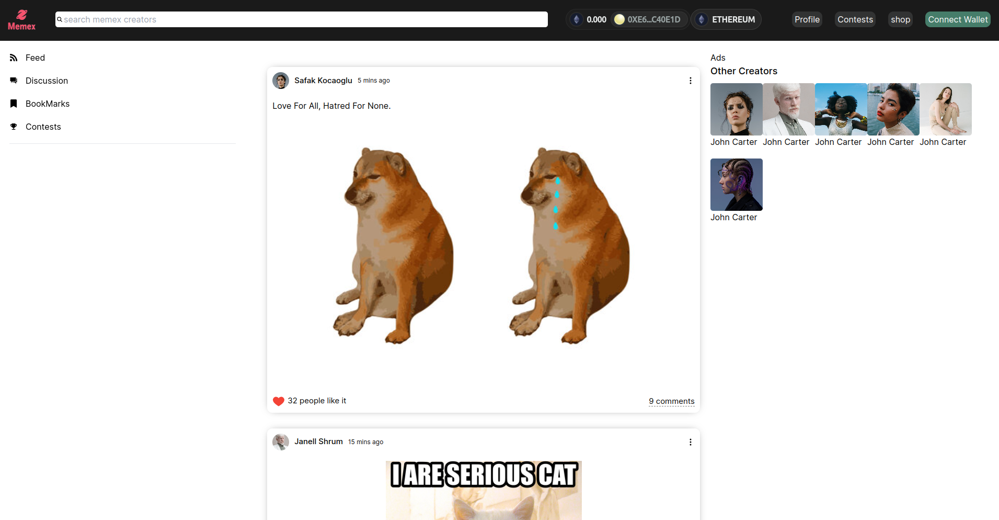
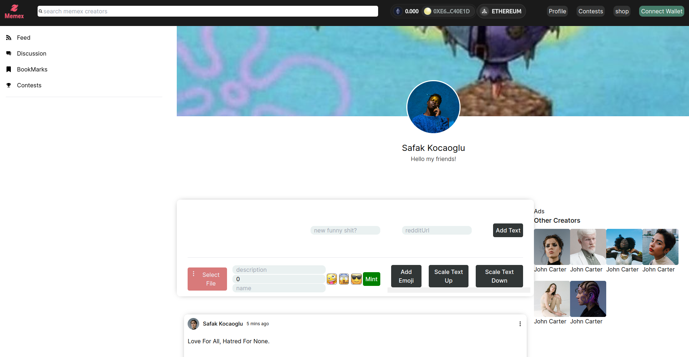
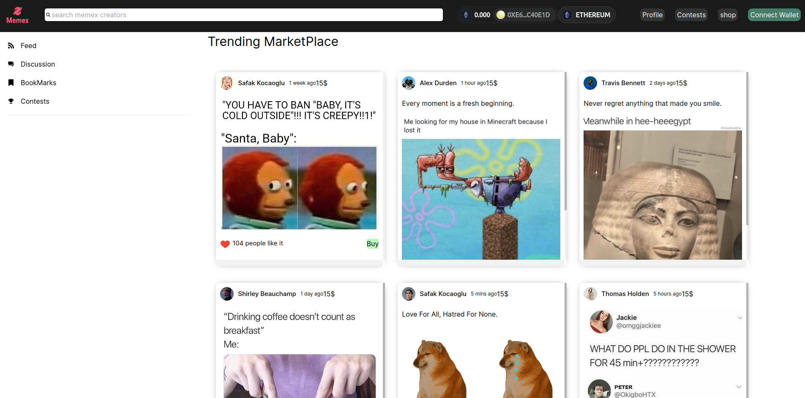

# Memex: Meme Authentication and Marketplace Platform

## 🛠 &nbsp;Tech Stack

NextJs,Chainlink,Web3.js,Ethereum,Express,Reddit-Api,Solidity

## 💼 &nbsp; Challenges We Ran Into

Getting the access to reddit api and creating a backend setup to dynamically fetch and give data back and forth between chainlink and reddit-api.

Also integration of nextjs with solidity contracts was quite difficult due to a module dependency error of material-ui

## 🔭 &nbsp; About This Project

> Are you tired of seeing your memes go viral without proper acknowledgment? Memex is here to change that! Our platform leverages Chainlink's technology to authenticate and track the popularity of memes, ensuring creators receive recognition and rewards. The marketplace, competitions, and secure environment make Memex the go-to place for meme enthusiasts.

---

**Description of the Project**

`Memex is a decentralized platform designed to address the challenges faced by meme creators on social media.`

           
How We Built It

           

### How we Integrated Chainlink

> Our journeyinto the blockchain realm led us to develop smart contracts using Solidity, with a particular focus on integrating Chainlink's technology. This crucial step ensures the authentication and tracking of meme popularity, guaranteeing proper recognition and rewards for creators.

### Reddit API Integration

> > The login page is user-friendly, remembering users to eliminate repeated sign-ins.

### Crafting the Memex Experience

> > > Our journey into building Memex's frontend began with the adoption of Next.js, a powerful React framework. The primary goal was to create a user-friendly and visually appealing interface that seamlessly integrates with the blockchain backend.

---

> 2) _About Us_: Learn more about our team's objective to bring out the best in users and provide a helping hand.

---

> 3) _Team_: Virtually meet our team.

> 4) _Contact_: Contact us for queries or additional information.

##  Achievements We're Proud Of :

### Revolutionizing Meme Authentication and Marketplace

> Memex stands as a testament to our commitment to innovation and the creation of a platform that addresses the unique challenges faced by meme creators. Here are some key accomplishments that we take pride in:

### 1. Authenticating Memes Through Blockchain:

Memex integrates blockchain technology, specifically utilizing the Solidity language and Chainlink's capabilities, to authenticate memes. This ensures that creators receive proper acknowledgment and rewards for their creations.

### 2. Seamless Frontend Experience with Next.js:

We successfully built a user-friendly and engaging frontend using Next.js, providing a smooth and responsive experience for users navigating through the platform.

### 3. Smart Contracts for Secure Marketplace Transactions:

Our team implemented robust smart contracts on the blockchain to facilitate secure and transparent transactions within the meme marketplace. This enhances the overall security and reliability of the platform.

### 4. Integration of Reddit API for Enhanced Authentication:

To augment meme authentication, we implemented a sophisticated backend using Express.js and Python. This backend leverages the Reddit API, allowing us to fetch relevant data and enhance the authenticity of memes on our platform.

## Contributing

Contributions are welcome! Follow these steps:

1. Fork the Project
2. Create your Feature Branch (`git checkout -b feature/AmazingFeature`)
3. Commit your Changes (`git commit -m 'Add some AmazingFeature'`)
4. Push to the Branch (`git push origin feature/AmazingFeature`)
5. Open a Pull Request

## 

Distributed under the MIT License. See `LICENSE` for more information.
